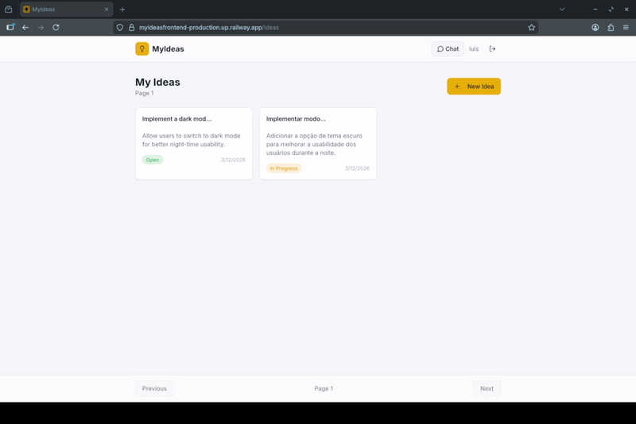
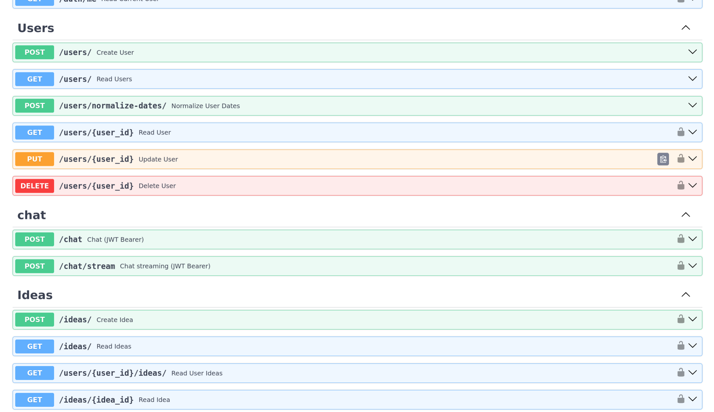
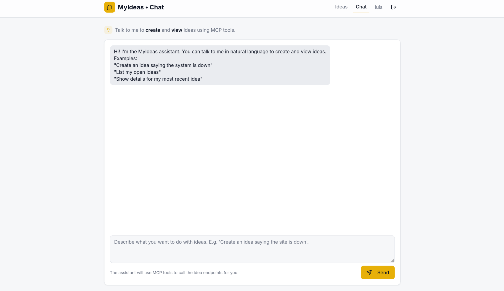
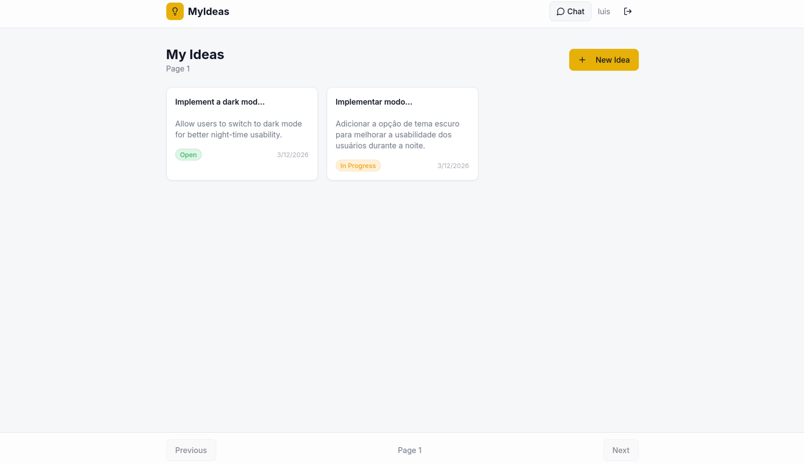

<h1 align="center">MyIdeas Backend</h1>
<h3 align="center">AI-powered Idea Management API</h3>

<p align="center">
  
  
  
  
  
  
</p>

---

<p align="center">
  
</p>

---

## Overview

MyIdeas Backend is a modern REST API built with FastAPI that allows users to create, manage, and refine ideas using artificial intelligence.

Instead of simply storing ideas, the system enables users to interact with an AI assistant, discuss concepts, iterate on them, and only persist them when they are fully developed.

---

## Demo (Chat + Idea Creation)

<p align="center">
  
</p>

---

## Key Highlights

- AI-assisted idea creation  
- Real-time chat with LLM  
- Save ideas directly from conversations  
- Image upload support  
- JWT-based authentication  
- Fully containerized with Docker  
- Scalable and modular architecture  

---

## Tech Stack

- FastAPI  
- Python  
- PostgreSQL  
- Docker & Docker Compose  
- JWT Authentication  
- LLM Integration (MCP)  

---

## Screenshots

### API Documentation
<p align="center">
  
</p>

### Chat System
<p align="center">
  
</p>

### Ideas Management
<p align="center">
  
</p>

---

## Architecture

```
app/
 ├── controllers/
 ├── routers/
 ├── services/
 ├── models/
 ├── schemas/
 ├── core/
 ├── infrastructure/
 ├── utils/
 ├── dependencies.py
 └── main.py
```

---

## Features

### Authentication
- User registration  
- Login with JWT  
- Protected routes  

### Users
- Create, read, update, delete users  
- Data normalization utilities  

### Ideas
- Full CRUD operations  
- Image association  
- Persistent storage  

### AI Chat
- Interactive chat with LLM  
- Streaming responses  
- Idea refinement workflow  
- Save ideas directly from chat  

---

## API Endpoints

### Auth
- `POST /token`  
- `POST /auth/login`  
- `POST /auth/register`  
- `GET /auth/me`  

### Users
- `POST /users/`  
- `GET /users/`  
- `GET /users/{user_id}`  
- `PUT /users/{user_id}`  
- `DELETE /users/{user_id}`  
- `POST /users/normalize-dates/`  

### Chat
- `POST /chat`  
- `POST /chat/stream`  

### Ideas
- Full CRUD support  
- Image upload integration  
- AI-assisted creation  

---

## How It Works

1. User registers and logs in  
2. Starts a chat session with the AI  
3. Refines the idea through conversation  
4. Saves the idea when ready  
5. Manages ideas later  

---

## Running the Project

### Docker (Recommended)

```bash
git clone https://github.com/LuisOctavioGSeror/MyIdeasBackend.git
cd MyIdeasBackend
docker-compose up --build
```

API: http://localhost:8000  
Docs: http://localhost:8000/docs  

---

### Local Development

```bash
python -m venv venv
source venv/bin/activate
pip install -r requirements.txt
uvicorn app.main:app --reload
```

---

## Why This Project Matters

This project goes beyond traditional CRUD systems by integrating AI into the idea creation workflow.

Users can think, iterate, and refine ideas before saving them — a process closer to real-world product development.

---

## License

Open-source for study and experimentation.
